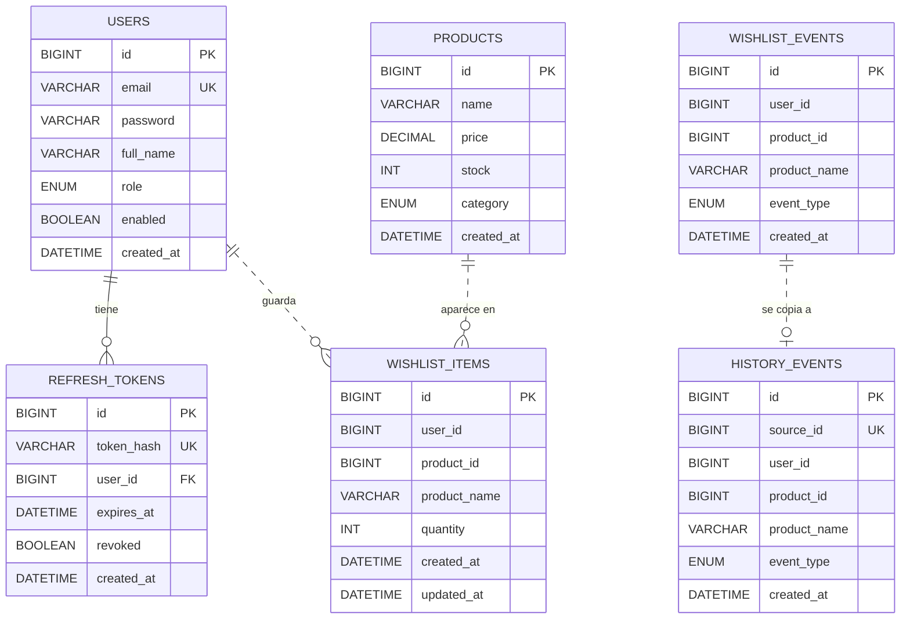

# SweetColors — Modelo de base de datos

## 1. Decisiones

- **Motor:** MySQL 8. Es relacional, maduro, y encaja con datos estructurados y con relaciones claras (usuarios, productos, listas de deseos).
- **ORM:** Spring Data JPA con Hibernate. Cada tabla se corresponde con una entidad (`@Entity`) del servicio dueño.
- **Una base de datos por microservicio:** `auth_db`, `catalog_db`, `wishlist_db` e `history_db`. Ningún servicio consulta la base de otro; solo se comunican por API REST.
- **Referencias entre servicios:** como las tablas viven en bases distintas, columnas como `user_id` o `product_id` en `wishlist_items` son **referencias lógicas** (no llaves foráneas reales). La integridad la garantiza la lógica del servicio: por ejemplo, al agregar un producto a la lista, wishlist-service confirma con catalog-service que el producto existe.

## 2. Diagrama entidad-relación

Línea continua (`--`) = llave foránea real dentro de la misma base. Línea punteada (`..`) = referencia lógica entre servicios.

## 3. Tablas por base de datos

### `auth_db` (auth-service)

| Tabla | Para qué sirve |
|---|---|
| `users` | Usuarios registrados. El correo es único, la contraseña se guarda con hash y el rol es `CLIENTE` o `ADMIN`. |
| `refresh_tokens` | Tokens de renovación de sesión (JWT). Se guardan hasheados y se pueden revocar (`revoked`). Cada uno pertenece a un usuario (FK `user_id`). |

### `catalog_db` (catalog-service)

| Tabla | Para qué sirve |
|---|---|
| `products` | Catálogo de productos: nombre, precio, cantidad en stock y categoría (`DESAYUNO` o `DECORACION`). |

### `wishlist_db` (wishlist-service)

| Tabla | Para qué sirve |
|---|---|
| `wishlist_items` | Lista de deseos actual de cada usuario. Restricción única `(user_id, product_id)`: un usuario no puede repetir un producto. Guarda `product_name` como copia para no depender del catálogo al mostrar la lista. |
| `wishlist_events` | Registro de todo lo que ocurre en la lista: agregado, actualizado, eliminado, o producto sin stock (`event_type`). Es la fuente del histórico. |

### `history_db` (history-service)

| Tabla | Para qué sirve |
|---|---|
| `history_events` | Histórico de eventos de la lista de deseos. Es una copia de `wishlist_events` traída por API; `source_id` es el id del evento original y es único para no duplicar. |

## 4. Reglas importantes

- Un usuario no puede tener el mismo producto dos veces en su lista (`uk_user_product`).
- El aviso de "sin stock" se registra como evento `OUT_OF_STOCK` una sola vez mientras el producto siga agotado; no se repite en cada consulta.
- Las contraseñas y los refresh tokens nunca se guardan en texto plano.
- Los scripts de creación están en `database/init/01-schema.sql` y los datos de ejemplo en `database/init/02-datos-ejemplo.sql`.